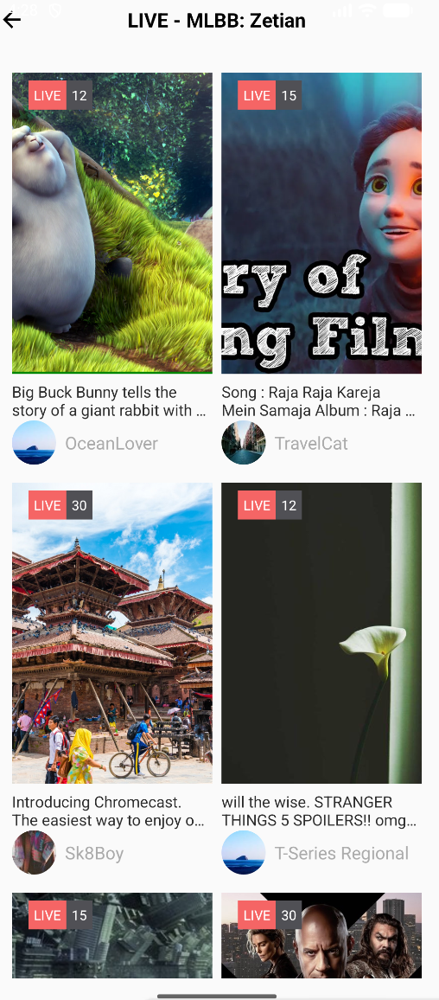
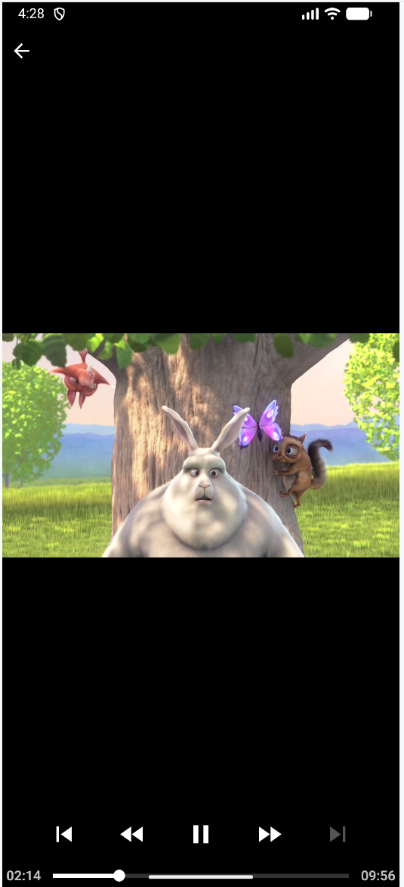

#TikTok简版瀑布流视频列表


## 项目简介

本项目是一款仿 TikTok 的轻量化视频展示应用，聚焦**瀑布流视频列表 + 在线视频播放**场景。通过网络请求拉取远程视频数据，以 2 列垂直瀑布流布局展示视频封面、用户信息及观看量，点击封面可跳转至全屏播放页，支持视频加载、暂停 / 播放、页面回退等基础交互，整体交互逻辑与视觉呈现贴合主流短视频应用体验。

## 项目结构

```
app
├── manifests
│   └── AndroidManifest.xml       # 应用配置（权限、Activity注册等）
├── java/com/bytedance/trainingcamp
│   ├── MainActivity.java         # 主页面，承载瀑布流RecyclerView
│   ├── VideoPlayerActivity.java  # 视频播放页，基于ExoPlayer实现全屏播放
│   ├── data                      # 数据层：网络请求+本地存储
│   │   ├── VideoApi.java         # 网络请求封装，拉取远程视频列表JSON
│   │   ├── MyDatabaseHelper.java # 数据库辅助类（预留本地数据存储能力）
│   │   └── ApiCallback.java      # 网络请求回调接口（内部嵌套于VideoApi）
│   ├── recyclerview              # 瀑布流列表相关组件
│   │   ├── adapter
│   │   │   └── StaggeredAdapter.java # RecyclerView适配器，管理数据与ViewHolder绑定
│   │   ├── bean
│   │   │   └── VideoBean.java    # 视频数据模型（用户信息、视频链接、封面等字段）
│   │   └── viewholder
│   │       └── VideoViewHolder.java # 列表项ViewHolder，负责UI组件绑定与点击事件
│   └── res                       # 资源目录
|       ├── drawable              # 基于xml绘制的图形
│       ├── layout
│       │   ├── all_video.xml     # 主页面布局（包含RecyclerView）
│       │   ├── video_player.xml  # 视频播放页布局（ExoPlayer+返回按钮）
│       │   └── recycler_item.xml # 瀑布流列表项布局（封面、头像、昵称等）
│       ├── mipmap                # 应用图标资源
│       └── values                # 字符串、颜色、样式等配置
└── build.gradle                  # 项目依赖配置（ExoPlayer、Glide、OkHttp等）
```


## 核心功能

### 瀑布流视频列表展示

- 基于`RecyclerView+StaggeredGridLayoutManager`实现 2 列垂直瀑布流布局，贴合短视频应用视觉习惯
- 列表项展示核心信息：用户头像（圆形裁剪）、用户名、视频描述、视频封面（居中裁剪）、观看量
- 支持数据源动态更新，通过`updateData`方法实现列表数据刷新

### 在线视频加载与播放

- 采用`ExoPlayer`作为视频播放核心（Google 官方推荐，支持多种视频格式，性能稳定）
- 点击视频封面跳转至全屏播放页，自动加载远程视频链接并播放
- 播放页支持基础控制：页面回退、暂停 / 播放（依赖 ExoPlayer 默认控制栏）

### 网络数据请求与解析

- 基于`OkHttp`封装网络请求工具类`VideoApi`，采用单例模式避免重复创建实例
- 支持请求耗时统计、错误回调、主线程切换（通过`Handler`实现子线程结果回调至 UI 线程）
- 利用`Gson`解析远程 JSON 数据，自动映射为`VideoBean`对象列表，解析高效且易维护

### 高效 UI 渲染与交互

- 使用`Glide`加载网络图片（头像 + 封面），支持圆形裁剪、居中裁剪，自带图片缓存机制
- 列表项点击事件与页面跳转逻辑解耦，通过`Intent`传递视频链接参数

## 使用说明

### 开发环境

下载并安装 [Android Studio](https://developer.android.com/studio)，打开项目后，Android Studio 会自动下载项目所需的 Gradle 版本、SDK 依赖，无需手动配置。

### 视频数据配置

- 视频数据来源：远程 JSON 接口（配置在`VideoApi.java`的`VIDEO_API_URL`常量中）
- 新增 / 修改视频数据：修改远程 JSON 文件中的`VideoBean`相关字段（需与`VideoBean.java`字段对应）
- 本地存储扩展：`MyDatabaseHelper`预留本地数据库能力，可扩展将远程视频数据缓存至本地

### 运行效果

 

## 注意事项

- 视频播放依赖网络环境，确保设备网络通畅（Wi-Fi / 移动数据）
- 若远程 JSON 接口不可用，可将视频数据本地存储至`assets`目录，修改`VideoApi`读取本地文件